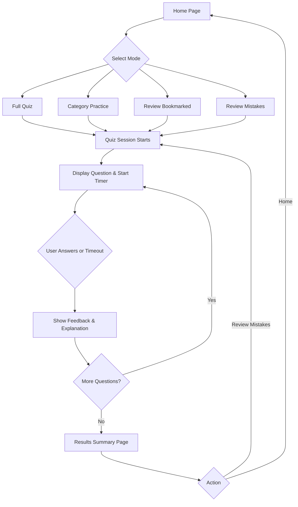

## 1. Product Overview
A single-page web application for nursing students to study multiple-choice questions. It provides a distraction-free, mobile-first study environment with a timer, live scoring, and bookmarking functionality for review, all operating entirely on the client side without a backend.

## 2. Core Features

### 2.1 Feature Module
1. **Home/Menu Page**: Quiz mode selection (Full Quiz, Practice by Category, Review Bookmarked, Review Mistakes).
2. **Quiz Page**: Question display, multiple-choice options, immediate feedback, and timer.
3. **Results Summary**: Score display, time taken, and detailed breakdown of correct/incorrect answers.

### 2.2 Page Details
| Page Name | Module Name | Feature description |
|-----------|-------------|---------------------|
| Home page | Mode Selection | Buttons to start Full Quiz, Category Quiz, Review Bookmarked, or Review Mistakes. Toggle for randomized question order. |
| Quiz page | Timer | Countdown timer (default 30s) per question. Locks answer if time runs out. |
| Quiz page | Question Card | Displays current question, clickable option cards, bookmark toggle. |
| Quiz page | Feedback Area | Reveals correct answer and explanation text after an option is selected. |
| Quiz page | Progress Bar | "Question X of Y" indicator. |
| Results page| Score Summary | Final score, percentage, and time taken. |
| Results page| Detailed Breakdown | List of all attempted questions with user's answer vs correct answer. |
| Results page| Actions | "Review Mistakes" button to start a new session with incorrect answers. |

## 3. Core Process
1. User lands on the Home Page and selects a quiz mode.
2. The app loads the filtered and randomized questions from `questions.json`.
3. The Quiz Page displays the first question and starts the timer.
4. User selects an answer (or timer runs out); the app highlights correct/incorrect options and shows the explanation.
5. User clicks "Next" to proceed.
6. Upon finishing all questions, the Results Page shows the summary and breakdown.
7. User can choose to review mistakes or return to the Home Page.

## 4. User Interface Design
### 4.1 Design Style
- Primary Color: Calm, focused study colors (e.g., deep slate blue, soft sage green).
- Secondary/Feedback Colors: Clear green for correct, soft red for incorrect.
- Font and sizes: Modern, highly readable typography pairing (e.g., standard Tailwind sans or Space Grotesk/Inter). Large tap targets.
- Layout style: Minimalist, card-based interface, centralized content.
- Icon/emoji style suggestions: Simple, outline icons for bookmarks and timer.
- Theme: System-aware with a dark mode toggle available (for night study).

### 4.2 Page Design Overview
| Page Name | Module Name | UI Elements |
|-----------|-------------|-------------|
| Home page | Menu | Large clear buttons, centered layout, calm background. |
| Quiz page | Main Area | Large question text, clearly separated option cards. Timer bar at top changing color in last 5s. |
| Results page| Breakdown List | Accordion or card list showing question, chosen answer, correct answer. |

### 4.3 Responsiveness
Mobile-first design. Large tap targets for phone screens. Adapts cleanly to desktop with constrained max-width for the quiz container.