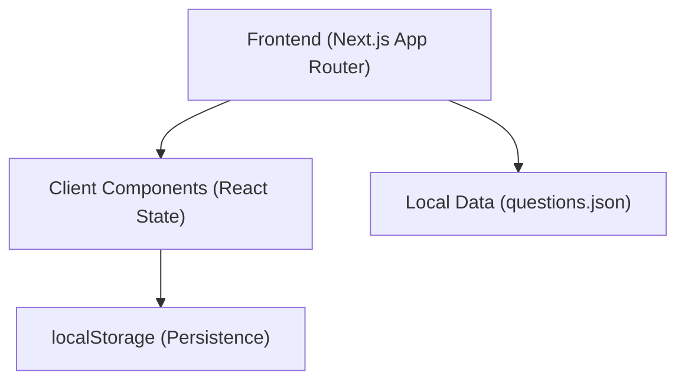
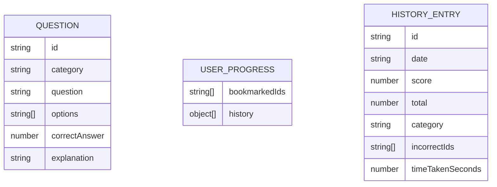

## 1. Architecture Design

## 2. Technology Description
- Frontend: Next.js (App Router) + TypeScript + tailwindcss@3
- State Management: React Context / Hooks (`useState`, `useEffect`)
- Persistence: Browser `localStorage` (via custom hooks)
- Icons: `lucide-react`
- Data Source: Local `data/questions.json`
- Initialization Tool: `create-next-app`

## 3. Route Definitions
| Route | Purpose |
|-------|---------|
| `/` | Home page (Mode selection, settings, history) |
| `/quiz` | Active quiz session interface |
| `/results` | Quiz summary and breakdown |

## 4. API Definitions
N/A (Fully client-side, no backend API required).

## 5. Server Architecture Diagram
N/A (No server/backend).

## 6. Data Model
### 6.1 Data Model Definition

### 6.2 Data Definition Language
N/A (Stored in `localStorage` as JSON objects matching the `USER_PROGRESS` schema).